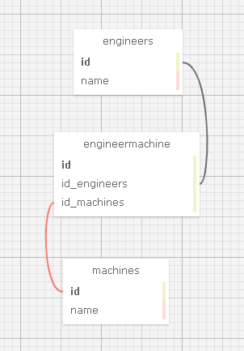

# _Factory_

#### _Many to Many Database Relationship Practice for Epicodus_ 
#### _DATE 01.08.2021_

#### By _**Jerrod Styrk**_

## Description

This application will help a factory manager keep track of the engineers and machines they have availible. It will allow you to add new Engineers, new Machines, as well all detailing which Engineers are licenced to repair which machine/s, and which machines are maintained by which Engineer/s. You can also remove any Engineers or machines that are no longer availible, as well as remove Engineers from machines or machines from Engineers. 

## Setup/Installation Requirements

Software Requirements
* An internet browser of your choice; I prefer Chrome
* A code editor; I prefer VSCode
* .NET Core
* MySQL
* MySQL Workbench

Open by Downloading or Cloning
- [Click to view Github repository](https://github.com/SJerrod/Factory.Solution.git) Or simply paste the following url into your prefered browser https://github.com/SJerrod/Factory.Solution.git
- To Clone repository simply click the green Code button and copy the url.
- Using a prefered terminal use the command 'git clone paste-url-here' in which ever directory you wish.
- Open the newly cloned repo with your text editor.
- In the terminal run command 'cd Factory'
- In the terminal run command 'dotnet restore'
- In the terminal run command 'dotnet build'
- In the terminal run command 'dotnet run'

AppSettings
* This project requires an AppSettings file. Create your `appsettings.json` file in the main `Factory` directory. 
* Format your `appsettings.json` file as follows including your unique password that was created at MySqlWorkbench installation:
```
{
  "ConnectionStrings":{
      "DefaultConnection": "Server=localhost;Port=3306;database=jerrod_styrk;uid=root;pwd=<YourPassword>;"
  }
}
```
* Update the Server, Port, and User ID as needed.

Import Database using Entity Framework Core
* Navigate to Factory.Solution/Factory and type `dotnet ef migrations add <MigrationName>` into the terminal
* Then, type `dotnet ef database update` into the terminal to create your database tables.

DB SQL Schema Snippet
* Paste this Schema Create Statement into your SQL Workbench to create this database and its tables.
```
CREATE DATABASE `jerrod_styrk` /*!40100 DEFAULT CHARACTER SET utf8mb4 COLLATE utf8mb4_0900_ai_ci */ /*!80016 DEFAULT ENCRYPTION='N' */;
CREATE TABLE `__efmigrationshistory` (
  `MigrationId` varchar(95) NOT NULL,
  `ProductVersion` varchar(32) NOT NULL,
  PRIMARY KEY (`MigrationId`)
) ENGINE=InnoDB DEFAULT CHARSET=utf8mb4 COLLATE=utf8mb4_0900_ai_ci;
CREATE TABLE `EngineerMachine` (
  `EngineerMachineId` int NOT NULL AUTO_INCREMENT,
  `EngineerId` int NOT NULL,
  `MachineId` int DEFAULT NULL,
  PRIMARY KEY (`EngineerMachineId`),
  KEY `IX_EngineerMachine_EngineerId` (`EngineerId`),
  KEY `IX_EngineerMachine_MachineId` (`MachineId`),
  CONSTRAINT `FK_EngineerMachine_Engineers_EngineerId` FOREIGN KEY (`EngineerId`) REFERENCES `engineers` (`EngineerId`) ON DELETE CASCADE,
  CONSTRAINT `FK_EngineerMachine_Machines_MachineId` FOREIGN KEY (`MachineId`) REFERENCES `machines` (`MachineId`) ON DELETE CASCADE
) ENGINE=InnoDB AUTO_INCREMENT=29 DEFAULT CHARSET=utf8mb4 COLLATE=utf8mb4_0900_ai_ci;
CREATE TABLE `engineers` (
  `EngineerId` int NOT NULL AUTO_INCREMENT,
  `Name` longtext,
  PRIMARY KEY (`EngineerId`)
) ENGINE=InnoDB AUTO_INCREMENT=12 DEFAULT CHARSET=utf8mb4 COLLATE=utf8mb4_0900_ai_ci;
CREATE TABLE `machines` (
  `MachineId` int NOT NULL AUTO_INCREMENT,
  `Name` longtext,
  PRIMARY KEY (`MachineId`)
) ENGINE=InnoDB AUTO_INCREMENT=11 DEFAULT CHARSET=utf8mb4 COLLATE=utf8mb4_0900_ai_ci;

```

SQL Database Design
<center>

</center>

## Known Bugs

This application has no known bugs. 

## Support and contact details

* Please feel free to reach out to <jstyrk@citadel.edu>

## Technologies Used

<details>
  <summary>Expand Tech/tools</summary>

* [Bootstrap Components](https://getbootstrap.com/docs/3.3/components/)
* C#
* Razor
* Entity Framework Core
* MySql
* MySql Workbench

</details>

### License

[](https://opensource.org/licenses/MIT)

Copyright (c) 2020 **_Jerrod Styrk_**